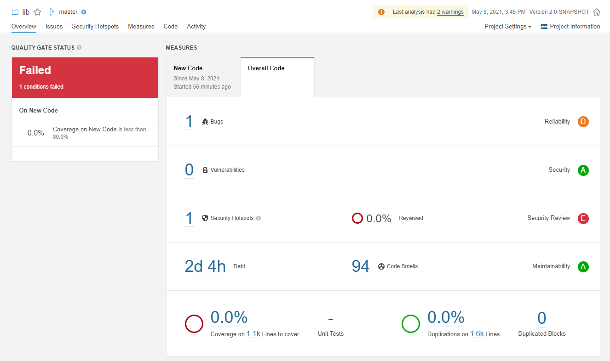
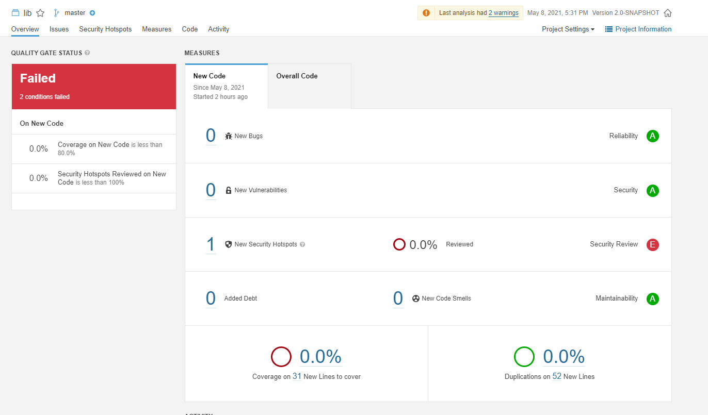

# Code analysis

## Overview of the task

Contributor(s), reviewer(s) and progress were tracked in this issue:
[#7](https://github.com/BME-MIT-IET/iet-hf2021-v-dqw4w9wgxcq/issues/7)

###Original description (in Hungarian)
Manuális kód átvizsgálás elvégzése az alkalmazás egy részére (GitHub, Gerrit...)
Statikus analízis eszköz futtatása és jelzett hibák átnézése (SonarQube,
SpotBugs, VS Code Analyzer, Codacy, Coverity Scan...).

Mivel az eszközök rengeteg hibát és figyelmeztetést találhatnak, ezért elég azok
egy részét megvizsgálni és ha a csapat minden tagja egyetért vele, akkor
javítani. Törekedjetek arra, hogy különböző típusú, és lehetőleg nem triviális
hibajelzéseket vizsgáljatok meg.

### Actionable subtasks
- Manual validation
    - Checking some of the source code
    - Fix the issues selected by the team
- Static analysis
    - Set up the staty analysis tool
    - Fix some of the issues selected by the team

## Work done

**Manual validation:** Reviewed all the files but `XSD2OWLMapper.java`. Found the problems mentioned by issues [#13](https://github.com/BME-MIT-IET/iet-hf2021-v-dqw4w9wgxcq/issues/13), [#15](https://github.com/BME-MIT-IET/iet-hf2021-v-dqw4w9wgxcq/issues/15), [#18](https://github.com/BME-MIT-IET/iet-hf2021-v-dqw4w9wgxcq/issues/18), [#19](https://github.com/BME-MIT-IET/iet-hf2021-v-dqw4w9wgxcq/issues/19), [#25](https://github.com/BME-MIT-IET/iet-hf2021-v-dqw4w9wgxcq/issues/19) and [#26](https://github.com/BME-MIT-IET/iet-hf2021-v-dqw4w9wgxcq/issues/26).

The team decided to fix issues [#13](https://github.com/BME-MIT-IET/iet-hf2021-v-dqw4w9wgxcq/issues/13), [#15](https://github.com/BME-MIT-IET/iet-hf2021-v-dqw4w9wgxcq/issues/15), [#18](https://github.com/BME-MIT-IET/iet-hf2021-v-dqw4w9wgxcq/issues/18) and [#19](https://github.com/BME-MIT-IET/iet-hf2021-v-dqw4w9wgxcq/issues/19), the solution for the problems can be seen in pull request [#33](https://github.com/BME-MIT-IET/iet-hf2021-v-dqw4w9wgxcq/pull/33)

**Static analysis:** Sonarqube has been set up based on issue [#29](https://github.com/BME-MIT-IET/iet-hf2021-v-dqw4w9wgxcq/issues/29). The pull request for the set up can be seen in [here](https://github.com/BME-MIT-IET/iet-hf2021-v-dqw4w9wgxcq/pull/34). 

The problems mentioned in [#39](https://github.com/BME-MIT-IET/iet-hf2021-v-dqw4w9wgxcq/issues/39) have been fixed. The solutions can be seen in [#40](https://github.com/BME-MIT-IET/iet-hf2021-v-dqw4w9wgxcq/pull/40).

## Printscreen (optional, if relevant)
**The project analysis by sonarqube after the setup:**

**And after the fixes:**

## Results
The workflow and the solutions can be seen in the issues and pull requests above.

In total the code quality has become better based on clean-code standards.
## Lessons learned
The takeaway is that static analysis tools are very helpful, but personal reviews are also important, because at the end of the day developers need to read and understand easily.
