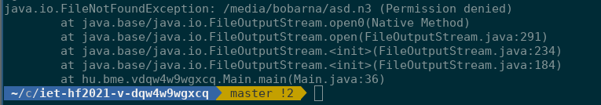
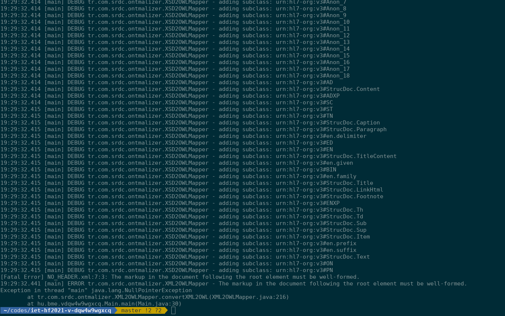
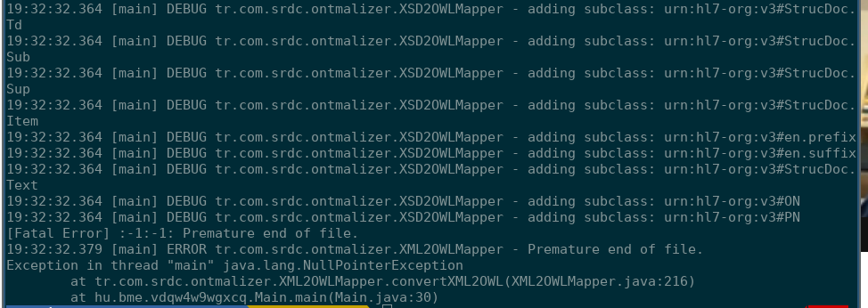
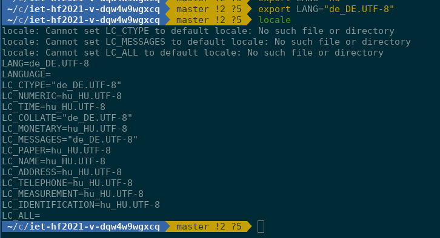

# Exploratory testing

## Overview of the task

Contributor(s), reviewer(s) and progress were tracked in this issue:
[#10](https://github.com/BME-MIT-IET/iet-hf2021-v-dqw4w9wgxcq/issues/10)

Exploratory Testing is a framework ideal for agile development environments. It relies on the individual tester's
competency. It involves active testing of the program, with a list of possible bugs defined beforehand.

### Original description (in Hungarian)
Manuális tesztek megtervezése, végrehajtása és dokumentálása vagy exploratory
testing.

### Actionable subtasks
- Creating a list of possible bugs to look for 
    - Analyze the possible root cause of these
- Test the application
- Review results
- Assess results

## Work done
- Invalid XML file as input
- Program has no write permission to the output folder
- Output file already exists
- Higher Java version (>8.0)
- /dev/null as input
- LANG environment variables

The application can be run with the following command:
```
cli/build/libs/cli-1.0-SNAPSHOT-all.jar <schema> <in> <out>
```

An example run of the application is as follows:
```
java -jar cli/build/libs/cli-1.0-SNAPSHOT-all.jar lib/src/test/resources/CDA/CDA.xsd lib/src/test/resources/CDA/SALUS-sample-full-CDA-instance.xml /tmp/salus-cda-instance.n3
```
*(from the project root directory)*


## Printscreen (optional, if relevant)
When had no access to the output file, the program ran, and displayed an error only at the end.



Displayed no error message when the XML file had no <xml...> header.
When the XML file was corrupted (missing a tag), the program ran into a nullpointer exception error after running for quite a long time.



The program ran successfully with higher java version.


When the input "file" was /dev/null (a.k.a an empty file), the application ran into an nullpointer exception error.



The LANG environment variable sadly had no effect on the program's output.


## Results
The CLI tool has its limitations, especially in terms of user experience. The interface lacks a lot in usability.
A good point is that when the 'cli-1.0-SNAPSHOT-all.jar <schema> <in> <out>' convention was not followed, the error message 
was clear in the expected input format. Although we found it strange that the CLI tool already started to process the available data.

When the inputted .xlsx file is not formatted properly, the tool either runs into a nullpointer exception error or gives a proper-looking output file.
None of these are desirable. 

It would be much better in terms of usability if a preprocessing of the XLSX file would be done, displaying the number of lines
where anomaly was detected.


## Lessons learned
- Testing is tricky
- Exploratory testing requires some practice
- Always commit local changes to git *(not related to exploratory testing)*
