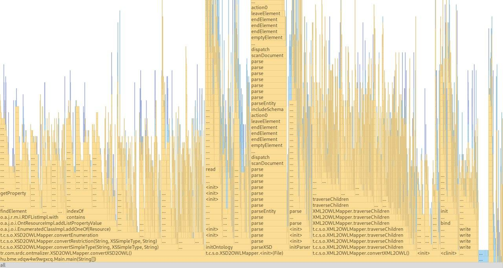

# Non-functional attributes

## Overview of the task

Contributor(s), reviewer(s) and progress were tracked in this issue:
[#8](https://github.com/BME-MIT-IET/iet-hf2021-v-dqw4w9wgxcq/issues/8)

### Original description (in Hungarian)
Nem-funkcionális jellemzők vizsgálata (teljesítmény, stresszteszt, biztonság,
használhatóság...)

## Work done
We ran the built-in flamegraph tool of the IntelliJ IDE on one of the test
cases. The results can be seen here:

Most of the time is taken up by the `convertXSD2OWL` function. This is to be
expected, since this is one of the main conversion routines of our whole
application. If we were looking to improve performance, this would be a good
place to start.

Something that might raise a bit more suspicion is that the bulk of the time is
taken up by calls to `findElement`, `contains`, `indexOf`, and other such
functions. Of these, `indexOf` is the most suspicious, since it suggests that
we are doing a linear search. The performance penalty for this is clearly not
negligible, as shown by the above flame graph.

Something also notable, is that XSD parsing takes a lot of time. (Event just
the `initParser` function itself is already visible on the graph.) XML parsing
is notoriously complex and slow, so while some improvements may be achieved in
this area, the underlying technology itself a performance barrier in this case.

## Results
If someone were to set out to improve performance, these are the steps we
recommend taking:
- Analyze the use of data structures during the conversion process, and assess
  their algorithmic complexity. We strongly suspect that significant
  improvements could be achieved with the use of better data structures.
- Explore whether XML itself could be replaced with a more performant data
  format.

## Lessons learned
Performance issues come in different forms. Some improvements can be as simple
as using a better built-in data structure. Others may be fundamental to the
technology used, and not improved easily.
